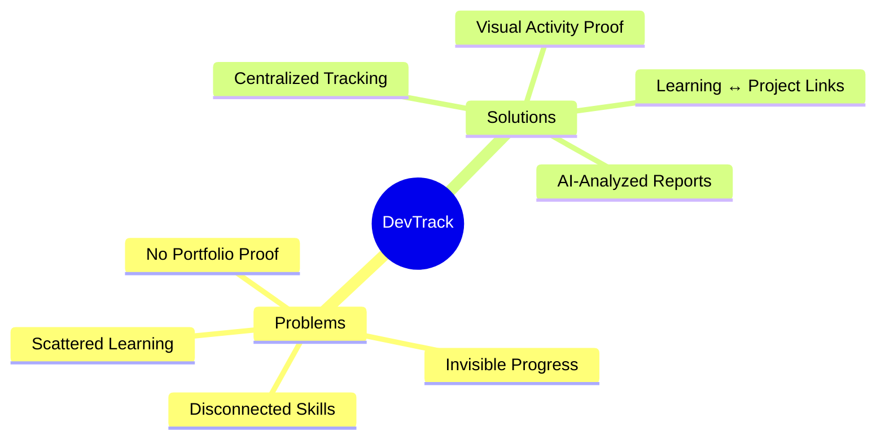
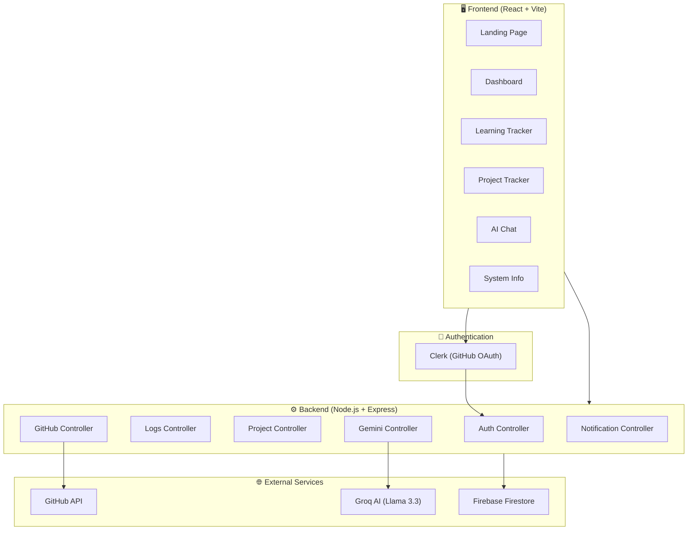
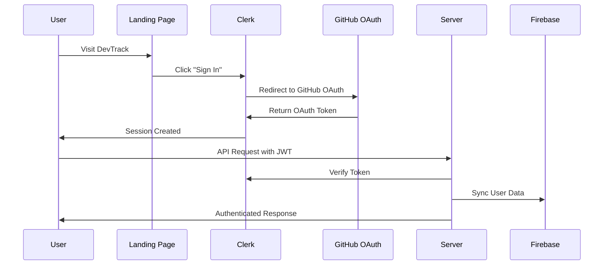
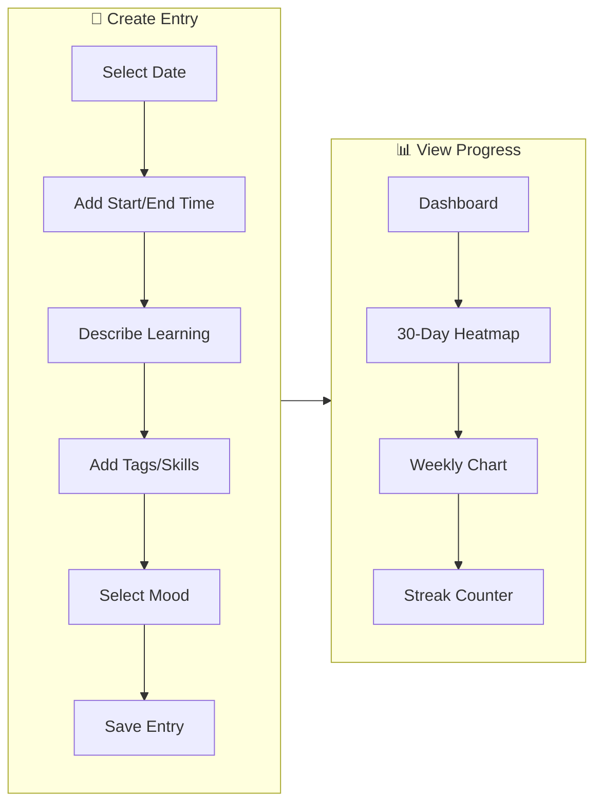
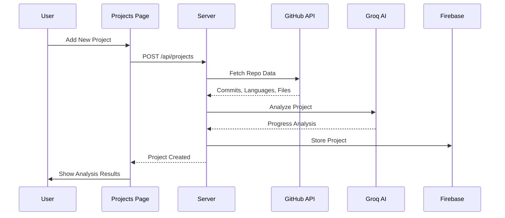
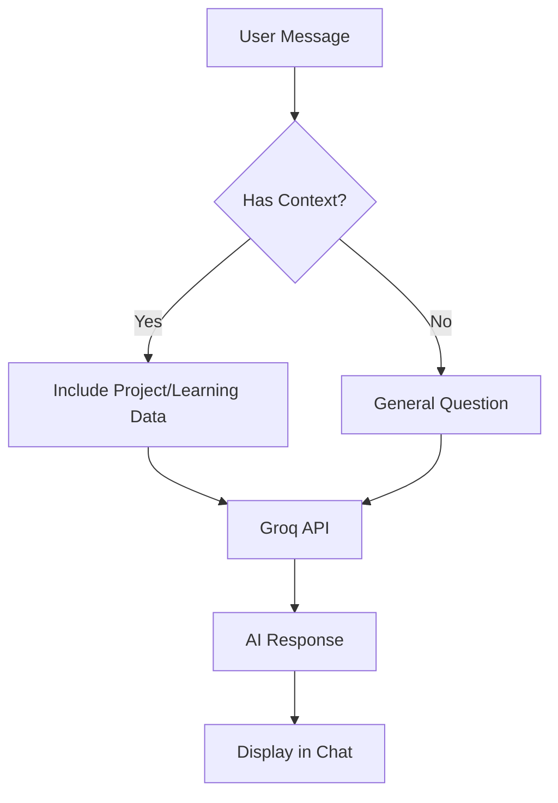
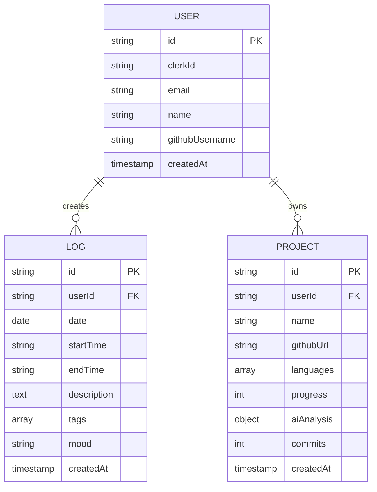

# 🚀 DevTrack - Complete Project Briefing

## Executive Summary

**DevTrack** is a full-stack developer productivity tracking application that helps developers document their learning journey, track projects, and build a provable record of consistent growth with AI-powered insights.

---

## 🎯 Problem Statement & Solution



| Problem | DevTrack Solution |
|---------|-------------------|
| **Scattered Learning** | Centralized tracking of courses, tutorials, and skills |
| **Invisible Progress** | Visual proof with 30-day heatmaps & streak counters |
| **Disconnected Skills** | Links what you learn → what you build |
| **No Portfolio Proof** | AI-analyzed project progress reports |

---

## 🏗️ System Architecture



---

## 📊 Technology Stack

| Layer | Technology | Purpose |
|-------|------------|---------|
| **Frontend** | React 18, Vite | UI Framework |
| **Routing** | React Router v6 | Client-side navigation |
| **Animations** | Framer Motion, GSAP | Smooth UI animations |
| **Styling** | Tailwind CSS | Utility-first styling |
| **Backend** | Node.js, Express.js | REST API server |
| **Database** | Firebase Firestore | NoSQL cloud database |
| **Auth** | Clerk | GitHub OAuth + session management |
| **AI** | Groq API (Llama 3.3 70B) | Project analysis & chat |
| **GitHub** | Octokit | Repository analysis |

---

## 📁 Project Structure

```
DevTrack/
├── 📂 client/                    # React Frontend
│   ├── 📂 src/
│   │   ├── 📂 components/
│   │   │   ├── 📂 Dashboard/     # Dashboard-specific components
│   │   │   ├── 📂 Landing/       # Landing page components
│   │   │   ├── 📂 layout/        # AppLayout, Navbar
│   │   │   └── 📂 ui/            # Button, Card, Badge
│   │   ├── 📂 pages/
│   │   │   ├── Dashboard.jsx     # Main user dashboard
│   │   │   ├── Learning.jsx      # Learning log tracker
│   │   │   ├── Projects.jsx      # Project management
│   │   │   ├── Chat.jsx          # AI chat assistant
│   │   │   ├── SystemInfo.jsx    # App documentation
│   │   │   └── Landing.jsx       # Public landing page
│   │   ├── 📂 services/
│   │   │   └── api.js            # Axios API client
│   │   ├── App.jsx               # Route definitions
│   │   └── main.jsx              # App entry point
│   └── package.json
│
└── 📂 server/                    # Node.js Backend
    ├── 📂 src/
    │   ├── 📂 config/
    │   │   └── firebase.js       # Firebase Admin SDK
    │   ├── 📂 controllers/
    │   │   ├── authController.js
    │   │   ├── logsController.js
    │   │   ├── projectController.js
    │   │   ├── githubController.js
    │   │   ├── geminiController.js
    │   │   └── notificationController.js
    │   ├── 📂 routes/
    │   │   ├── authRoutes.js
    │   │   ├── logsRoutes.js
    │   │   ├── projectRoutes.js
    │   │   ├── githubRoutes.js
    │   │   ├── geminiRoutes.js
    │   │   └── notificationRoutes.js
    │   ├── 📂 services/          # Business logic
    │   ├── 📂 middleware/        # Auth, error handling
    │   └── app.js                # Express app config
    └── package.json
```

---

## 🔄 Core User Flows

### 1️⃣ Authentication Flow



### 2️⃣ Learning Log Flow



### 3️⃣ Project Tracking Flow



### 4️⃣ AI Chat Flow



---

## 🖼️ Wireframes

### Landing Page Wireframe

```
┌────────────────────────────────────────────────────────────────┐
│  [Logo] DevTrack                              [Sign In] [GitHub]│
├────────────────────────────────────────────────────────────────┤
│                                                                 │
│    ╔═══════════════════════════════════════════════════════╗   │
│    ║         🚀 Track Your Developer Journey               ║   │
│    ║    Prove consistency. Connect learning to real work.  ║   │
│    ║              [Get Started Free →]                     ║   │
│    ╚═══════════════════════════════════════════════════════╝   │
│                                                                 │
│    ┌─────────────────────────────────────────────────────┐     │
│    │              [ Animated Dashboard Mockup ]           │     │
│    │     ┌──────┐ ┌──────┐ ┌──────┐ ┌──────┐             │     │
│    │     │Stats │ │Graph │ │Heat  │ │Proj  │             │     │
│    │     └──────┘ └──────┘ │ Map  │ │List  │             │     │
│    │                       └──────┘ └──────┘             │     │
│    └─────────────────────────────────────────────────────┘     │
│                                                                 │
├────────────────────────────────────────────────────────────────┤
│                      ✨ FEATURES                                │
│  ┌─────────────┐ ┌───────────────────┐ ┌─────────────┐         │
│  │ 📚 Learning │ │  🛠️ Project       │ │ 🤖 AI Chat │         │
│  │   Tracker   │ │     Tracker       │ │  Assistant  │         │
│  │             │ │                   │ │             │         │
│  └─────────────┘ └───────────────────┘ └─────────────┘         │
│                                                                 │
│  ┌─────────────┐ ┌───────────────────┐ ┌─────────────┐         │
│  │ 📊 Activity │ │ 🐙 GitHub         │ │ 📈 Progress │         │
│  │   Heatmaps  │ │    Integration    │ │   Reports   │         │
│  └─────────────┘ └───────────────────┘ └─────────────┘         │
├────────────────────────────────────────────────────────────────┤
│                       👥 TEAM                                   │
│       [Member 1]    [Member 2]    [Member 3]    [Member 4]     │
├────────────────────────────────────────────────────────────────┤
│  © 2024 DevTrack by Vortex-16               [GitHub] [Twitter] │
└────────────────────────────────────────────────────────────────┘
```

### Dashboard Wireframe

```
┌────────────────────────────────────────────────────────────────┐
│ ┌──────────────────────────────────────────────────────────┐   │
│ │  🏠 Dashboard  📚 Learning  🛠️ Projects  💬 Chat  ℹ️ Info │   │
│ └──────────────────────────────────────────────────────────┘   │
├────────────────────────────────────────────────────────────────┤
│                                                                 │
│  👋 Welcome back, [Username]!                     [+ New Entry] │
│                                                                 │
│  ┌──────────────┐ ┌──────────────┐ ┌──────────────┐            │
│  │ 🔥 Streak    │ │ 📝 Entries   │ │ 🛠️ Projects │            │
│  │    15 Days   │ │     42       │ │      8       │            │
│  └──────────────┘ └──────────────┘ └──────────────┘            │
│                                                                 │
│  ┌────────────────────────────┐ ┌──────────────────────────┐   │
│  │   📊 Weekly Activity       │ │  🗓️ 30-Day Heatmap      │   │
│  │  ▓▓▓▓▓▓                    │ │  □■■□□■■                 │   │
│  │  ▓▓▓▓▓▓▓▓                  │ │  ■■□■■□■                 │   │
│  │  ▓▓▓▓▓▓▓▓▓▓                │ │  □■■■□■■                 │   │
│  │  ▓▓▓▓                      │ │  ■■■■■■□                 │   │
│  │  Mon Tue Wed Thu Fri Sat Sun│ │  (intensity by entries) │   │
│  └────────────────────────────┘ └──────────────────────────┘   │
│                                                                 │
│  ┌────────────────────────────────────────────────────────┐    │
│  │  📜 Recent Activity                                    │    │
│  │  ─────────────────────────────────────────────────────│    │
│  │  🟢 Today    Learned React Hooks         [React][Hooks]│    │
│  │  🟢 Yesterday Added new project           [DevTrack]  │    │
│  │  🟡 3 days   Completed TypeScript course  [TypeScript]│    │
│  └────────────────────────────────────────────────────────┘    │
└────────────────────────────────────────────────────────────────┘
```

### Learning Page Wireframe

```
┌────────────────────────────────────────────────────────────────┐
│                    📚 Learning Tracker                          │
├────────────────────────────────────────────────────────────────┤
│                                                                 │
│  ┌───────────────────────────────────────────────────────────┐ │
│  │  ➕ NEW LEARNING ENTRY                          [+ Add]   │ │
│  ├───────────────────────────────────────────────────────────┤ │
│  │  📅 Date: [2024-12-13]                                    │ │
│  │  ⏰ Time: [10:00 AM] to [12:00 PM]                        │ │
│  │  📝 What did you learn?                                   │ │
│  │  ┌─────────────────────────────────────────────────────┐  │ │
│  │  │                                                     │  │ │
│  │  │  Textarea for learning description...               │  │ │
│  │  │                                                     │  │ │
│  │  └─────────────────────────────────────────────────────┘  │ │
│  │  🏷️ Tags: [React] [TypeScript] [Node.js] [+ Add Tag]     │ │
│  │  😊 Mood: ○ 😊 ○ 😐 ○ 😕                                  │ │
│  └───────────────────────────────────────────────────────────┘ │
│                                                                 │
│  ┌───────────────────────────────────────────────────────────┐ │
│  │  📋 YOUR LEARNING LOG                    [Filter ▼] [🔍] │ │
│  ├───────────────────────────────────────────────────────────┤ │
│  │  ┌─────────────────────────────────────────────────────┐  │ │
│  │  │ 📅 Dec 13, 2024  •  2 hours  •  😊                  │  │ │
│  │  │ Learned about React useState and useEffect hooks    │  │ │
│  │  │ [React] [Hooks]                       [Edit][Delete]│  │ │
│  │  └─────────────────────────────────────────────────────┘  │ │
│  │  ┌─────────────────────────────────────────────────────┐  │ │
│  │  │ 📅 Dec 12, 2024  •  1.5 hours  •  😐                │  │ │
│  │  │ TypeScript generics and utility types               │  │ │
│  │  │ [TypeScript]                          [Edit][Delete]│  │ │
│  │  └─────────────────────────────────────────────────────┘  │ │
│  └───────────────────────────────────────────────────────────┘ │
└────────────────────────────────────────────────────────────────┘
```

### Projects Page Wireframe

```
┌────────────────────────────────────────────────────────────────┐
│                    🛠️ Project Tracker                          │
├────────────────────────────────────────────────────────────────┤
│                                                                 │
│  [+ Add Project]     🔍 Search: [________________]             │
│                                                                 │
│  ┌────────────────────────────────────────────────────────┐    │
│  │  📦 DevTrack                                            │    │
│  │  ─────────────────────────────────────────────────────  │    │
│  │  🔗 github.com/user/devtrack                            │    │
│  │                                                          │    │
│  │  ┌──────────────────────────────────────────────────┐   │    │
│  │  │ 📊 Progress: ████████████░░░░░░░░░░░░ 65%        │   │    │
│  │  └──────────────────────────────────────────────────┘   │    │
│  │                                                          │    │
│  │  💻 Languages: [JavaScript] [Python] [TypeScript]       │    │
│  │                                                          │    │
│  │  🤖 AI Analysis:                                         │    │
│  │  "Good progress on frontend. Consider adding tests."    │    │
│  │                                                          │    │
│  │  📈 Commits: 142  |  🔀 PRs: 12  |  ⚡ Issues: 5        │    │
│  │                                                          │    │
│  │  [View Details] [Re-analyze] [Edit] [Delete]            │    │
│  └────────────────────────────────────────────────────────┘    │
│                                                                 │
│  ┌────────────────────────────────────────────────────────┐    │
│  │  📦 Weather App                                         │    │
│  │  🔗 github.com/user/weather-app                         │    │
│  │  📊 Progress: ████████████████████░░░░ 85%              │    │
│  │  💻 [React] [CSS]                                        │    │
│  └────────────────────────────────────────────────────────┘    │
└────────────────────────────────────────────────────────────────┘
```

### AI Chat Page Wireframe

```
┌────────────────────────────────────────────────────────────────┐
│                    💬 AI Chat Assistant                         │
├────────────────────────────────────────────────────────────────┤
│                                                                 │
│  ┌────────────────────────────────────────────────────────┐    │
│  │                                                         │    │
│  │  🤖 Hi! I'm your DevTrack AI assistant. I have access  │    │
│  │     to your projects and learning data. How can I      │    │
│  │     help you today?                                    │    │
│  │                                                         │    │
│  │  ─────────────────────────────────────────────────────│    │
│  │                                                         │    │
│  │  👤 What should I learn next based on my projects?     │    │
│  │                                                         │    │
│  │  ─────────────────────────────────────────────────────│    │
│  │                                                         │    │
│  │  🤖 Based on your DevTrack project using React and     │    │
│  │     Node.js, I'd suggest learning:                     │    │
│  │     1. TypeScript for better type safety               │    │
│  │     2. Testing with Jest and React Testing Library     │    │
│  │     3. CI/CD with GitHub Actions                       │    │
│  │                                                         │    │
│  └────────────────────────────────────────────────────────┘    │
│                                                                 │
│  ┌────────────────────────────────────────────────────────┐    │
│  │  💬 Type your message...                        [Send] │    │
│  └────────────────────────────────────────────────────────┘    │
└────────────────────────────────────────────────────────────────┘
```

---

## 🔌 API Endpoints Reference

### Authentication (`/api/auth`)
| Method | Endpoint | Description |
|--------|----------|-------------|
| POST | `/sync` | Sync user data from Clerk to Firebase |
| GET | `/me` | Get current user profile |

### Learning Logs (`/api/logs`)
| Method | Endpoint | Description |
|--------|----------|-------------|
| GET | `/` | Get all learning entries (paginated) |
| GET | `/:id` | Get specific entry |
| POST | `/` | Create new entry |
| PUT | `/:id` | Update entry |
| DELETE | `/:id` | Delete entry |
| GET | `/stats` | Get learning statistics |

### Projects (`/api/projects`)
| Method | Endpoint | Description |
|--------|----------|-------------|
| GET | `/` | Get all projects |
| GET | `/:id` | Get specific project |
| POST | `/` | Create new project |
| PUT | `/:id` | Update project |
| DELETE | `/:id` | Delete project |
| GET | `/stats` | Get project statistics |

### GitHub (`/api/github`)
| Method | Endpoint | Description |
|--------|----------|-------------|
| GET | `/profile` | Get GitHub profile |
| GET | `/repos` | Get user repositories |
| GET | `/languages` | Get programming languages |
| GET | `/repo/:owner/:repo` | Analyze specific repo |
| GET | `/activity` | Get recent activity |
| GET | `/commits` | Get commit history |

### AI/Gemini (`/api/gemini`)
| Method | Endpoint | Description |
|--------|----------|-------------|
| POST | `/chat` | Send chat message |
| POST | `/analyze-project` | AI project analysis |

---

## 🗄️ Data Models



---

## 🔐 Security Features

1. **Authentication**: Clerk with GitHub OAuth
2. **JWT Verification**: All API routes protected
3. **Rate Limiting**: 
   - General: 500 req/15min
   - AI endpoints: 100 req/15min
4. **CORS**: Configured for frontend origin
5. **Helmet**: Security headers
6. **Input Validation**: Request body validation

---

## 📈 Roadmap

- [x] Core authentication with Clerk
- [x] Learning entry CRUD
- [x] Project tracking & AI analysis
- [x] GitHub integration
- [x] Dashboard with visualizations
- [x] AI Chat assistant
- [ ] Export/share progress reports
- [ ] Push notifications
- [ ] Mobile app

---

## 🚀 Getting Started

### Prerequisites
- Node.js v18+
- Firebase project
- Clerk account
- Groq API key
- GitHub OAuth app

### Quick Start
```bash
# Clone & Install
git clone https://github.com/Vortex-16/DevTrack.git
cd DevTrack

# Server setup
cd server && npm install
# Add .env with credentials

# Client setup  
cd ../client && npm install
# Add .env with API URL & Clerk key

# Run
cd server && npm run dev
cd ../client && npm run dev
```

---

> **Built with ❤️ by Vortex-16 to help developers prove their growth**
